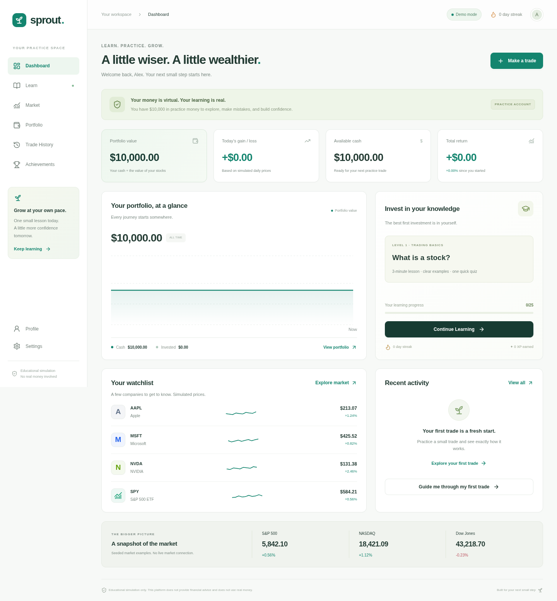
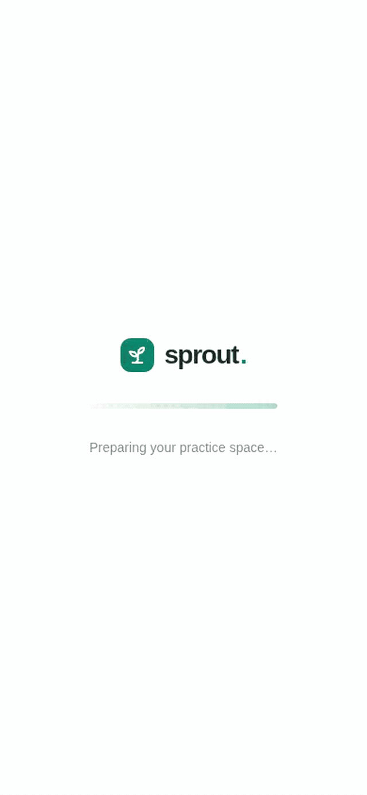
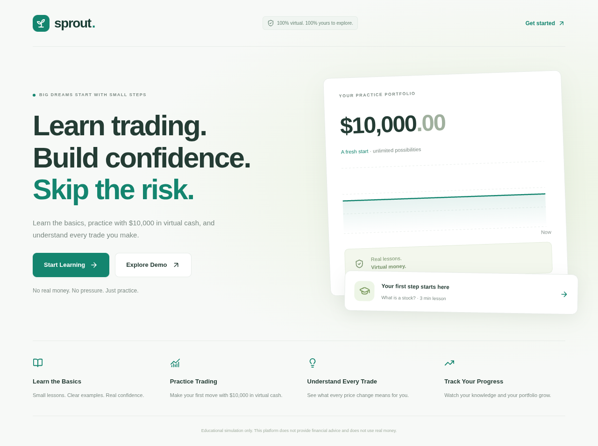
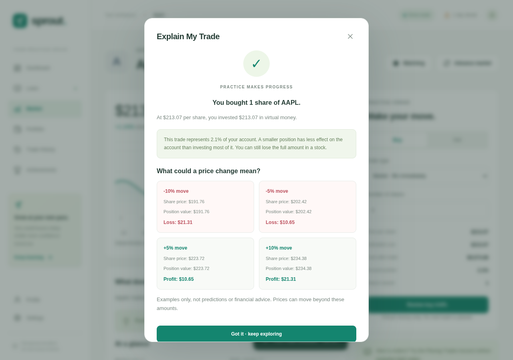
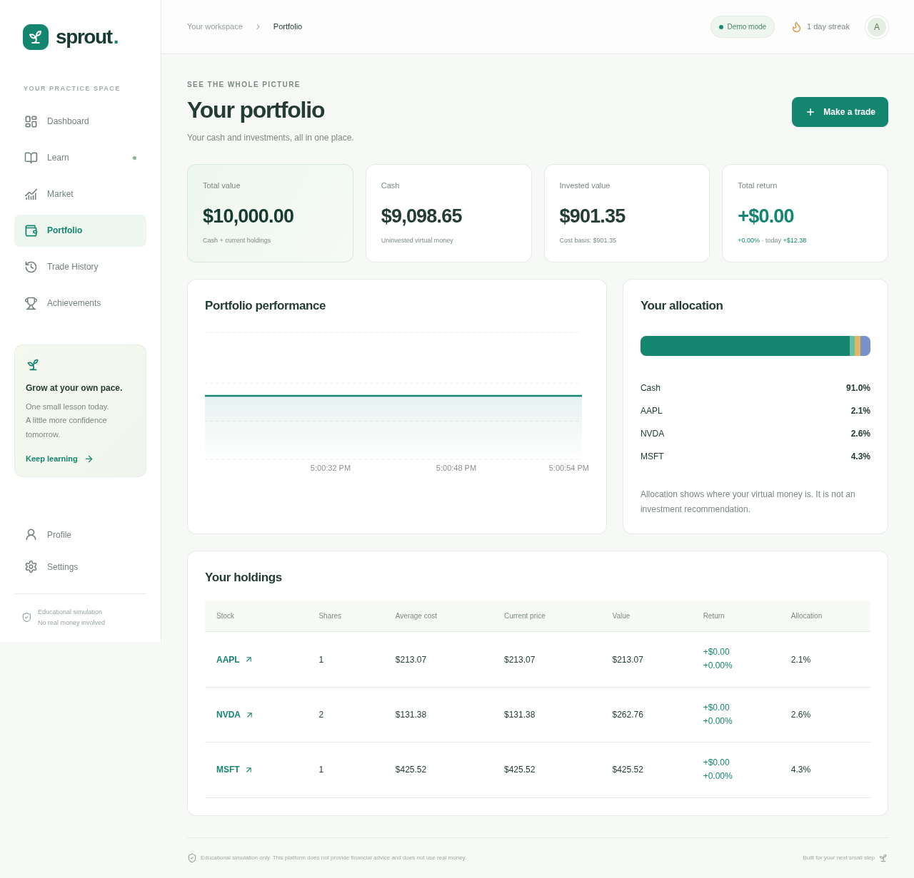
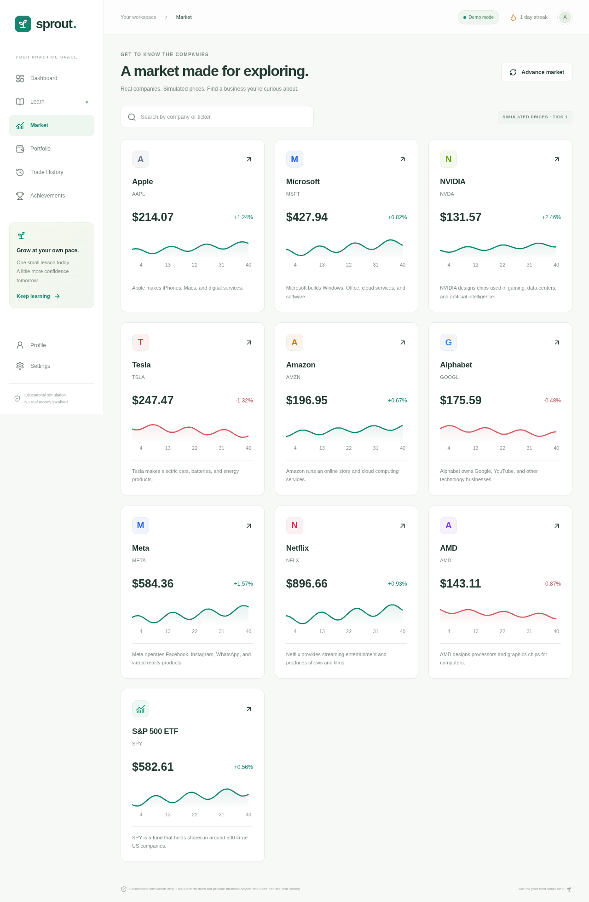
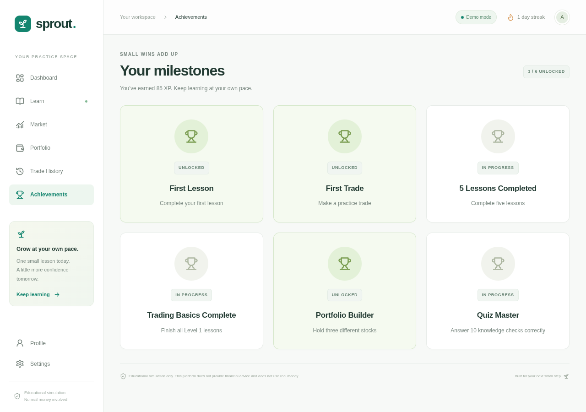

# Sprout — trading simulator

A beginner-friendly stock education and paper-trading app. Learn in small steps, practice with **$10,000 in virtual cash**, and understand every trade. Educational simulation only: no real money, financial advice, or promised returns.

## Latest financial workspace design

A redesigned welcome page, restrained green brand palette, readable financial summaries, simulated market snapshot strip, global stock search, and sortable market table with an optional card view. Inspired by established brokerage and financial research layouts, with original Sprout branding. Sign-in is available from the header; all market examples remain clearly labeled simulated.

[Homepage preview](docs/previews/institutional-home-desktop.png) · [Dashboard preview](docs/previews/institutional-dashboard-desktop.png) · [Market table preview](docs/previews/institutional-market-desktop.png) · [Mobile preview](docs/previews/institutional-home-mobile.png)

## App preview

**[Open the full gallery: 28 pictures and 4 videos](docs/previews/README.md)**

You can view the screenshots and moving previews on GitHub without downloading the app.

### Dashboard



### Video previews

#### From welcome to your first lesson and trade

[](docs/previews/01-first-steps.mp4)

#### Buying, tracking a portfolio, and selling

[](docs/previews/02-portfolio-trading.mp4)

#### Explore stocks, charts, watchlists, and limit orders

[](docs/previews/03-market-limit-orders.mp4)

#### A complete tour on a phone-sized screen

[](docs/previews/04-mobile-tour.mp4)

### More screens

#### Welcome page



#### Understand price moves and position size



#### Three-stock portfolio, returns, and allocation



#### Ten simulated stocks and funds



#### First Lesson, First Trade, and Portfolio Builder



[View all desktop and mobile screenshots](docs/previews/README.md)

## Features

- First-run landing page and experience-based onboarding; automatic Beginner Mode for new learners.
- Dashboard with account value, cash, invested value, daily change, total return, watchlist, recent trades, learning progress, and market examples.
- All 54 lessons across eleven levels, examples, explanations, quizzes, accuracy, learning streak, XP, level-completion bonuses, and six achievements.
- Searchable, paginated market with 11,787 US-listed securities (5,754 ETFs), company descriptions, line/candlestick charts, five timeframes, and watchlist controls. Candles show simulated open/high/low/close prices with hover and keyboard-accessible period inspection.
- A five-lesson Candlestick Practice level covers bodies/wicks, colors/gaps, doji, hammers, and engulfing patterns with visual examples and quizzes. Stock charts link directly to the first lesson.
- Whole-share market buys and sells, weighted average cost, realized/unrealized gains, friendly validation, and Beginner Mode confirmations.
- Pending limit orders, cancellation, and deterministic market advancement. Every fill opens **Explain My Trade**, including 5%/10% price and dollar scenarios. History can reopen explanations.
- Holdings, portfolio allocation, performance chart, profile settings, simulator reset, and separate learning reset.
- Responsive desktop/mobile navigation, native modal focus handling and Escape dismissal, reduced-motion support, loading/error/empty states, and local persistence.

## Stack and setup

Next.js App Router, React, strict TypeScript, Tailwind CSS 4 plus shared design tokens, Recharts, and Lucide. npm is the package manager; the lockfile is included. Node **24** is recommended (the browser-test package requires Node 22.17+).

```bash
npm ci
npm run dev
```

The development server listens on port 3000. For production:

```bash
npm run build
npm start
```

## Accounts and Supabase

The app supports both local guest practice and Supabase email accounts. **Save your progress** appears on the welcome page and dashboard. Create an account, confirm your email if required, and sign in. Supabase's client restores sessions across reloads and refreshes access tokens. Signed-in portfolio and learning progress are stored in `public.paper_accounts`, with owner-only row-level security. Guest data stays separate and is never automatically uploaded or overwritten when you sign in.

The project owner's public Supabase URL and publishable key are defaults in `lib/supabase/client.ts`; these browser credentials are not secret. Optional build-time overrides are `NEXT_PUBLIC_SUPABASE_URL` and `NEXT_PUBLIC_SUPABASE_ANON_KEY`. Never use service-role or secret keys in browser configuration.

Run `supabase/schema.sql` in the Supabase SQL Editor before using cloud accounts. In Authentication → URL Configuration, set Site URL to your deployed HTTPS origin and add it to Redirect URLs. Enable email authentication. Email delivery and confirmation depend on the project's Supabase settings.

Signed-in changes save asynchronously. A saving overlay blocks new actions until saving finishes. Failed saves revert to the prior state and show an error. Saves compare `updated_at` atomically so a stale tab/device cannot overwrite newer data; reload after a conflict. State is validated when loading. Cloud loading failure blocks trading until you retry or sign out. This is an educational simulator: the browser calculates trades and users can edit their own state, so it is not a trusted financial ledger.

For guests, state uses `sprout-trading-v1` in localStorage and open tabs synchronize changes. Clearing browser data removes guest progress; guest accounts are separate across browsers/devices.

## Deploying this version

Import this repository into Vercel using the `sprout-supabase` branch, with framework **Next.js**, default `npm run build`, and no custom output-directory override. The previous directly uploaded demo will not change automatically unless its Vercel project is connected to this repository and branch or this branch is deployed separately.

## Market and trading behavior

`lib/market/index.ts` provides deterministic simulated prices on a shared two-second clock, 24/7. LIVE charts show 30-second candles over 20 minutes; longer ranges are available. Prices and history are entirely simulated, never a real market feed. Baselines are rough public snapshot prices or illustrative fallback values; missing company statistics are marked unavailable. Market overview numbers are static seeded examples.

Market orders fill immediately at the current quote, without fees or slippage. Whole shares only; no margin, shorting, or fractional shares. Prices and cash transactions are rounded to cents. Weighted average cost retains precision internally and is formatted to cents in the UI.

Pending limits are evaluated automatically on new clock ticks while the app is open, using the buy-at-or-below/sell-at-or-above condition. Advance market remains available for an extra practice step. Orders do not execute on a server while the app is closed. No cash or shares are reserved. At a trigger, resources are checked again; insufficient-resource orders cancel. Limits far from the bounded seeded prices may never fill. Orders are evaluated newest first; manual fills receive explanation dialogs. Stop orders are taught but not implemented.

Portfolio value equals cash plus current holdings. Total return is measured against the original $10,000. Today’s gain/loss estimates current holdings’ movement from the simulated previous daily close, rather than an exact intraday account ledger. Sell explanations show realized profit/loss and clearly label future scenarios as hypothetical.

`MarketDataProvider` separates quotes/history from components. A real provider should fetch/cache normalized quotes and historical data through a server endpoint, keep API secrets server-side, display market timestamps, and add loading/stale/error handling. Update the financial engine to use execution-time validated prices rather than trusting client quotes.

## Architecture

- `app/`: route entry point, layout, loading and error boundaries, responsive design system.
- `components/screens/`: landing, dashboard, market, stock detail, portfolio, trade history, achievements, preferences.
- `components/Simulator.tsx`: navigation and application coordination.
- `components/Learning.tsx`, `Trading.tsx`, `Chart.tsx`, `Dialog.tsx`, `ui/`: reusable interactive UI.
- `lib/trading/`: single source for account initialization, buy/sell validation, weighted cost, portfolio values, limits, and trade scenarios.
- `lib/market/`: deterministic seeded data and replaceable provider interface.
- `lib/education/`: 54 lessons, quizzes, completion/XP/streak rules, and achievements.
- `lib/storage/`: persistence adapter and hydration-safe React account subscription.
- `types/`: users, profiles, preferences, accounts, stocks/history, holdings, trades/orders, lessons/quizzes, attempts/progress, and achievements.
- `tests/`: financial/learning/storage unit tests and browser journeys.

Lesson XP is awarded once per correct first completion: 35 XP; completing a full level adds 100 XP. The first completed trade adds 50 XP. Correct retries of completed lessons do not add XP. Quiz accuracy includes all attempts. A learning day is based on UTC dates.

## Verification

```bash
npm run lint
npm run typecheck # Generates Next.js route types before checking TypeScript
npm test
npm run build
```

Start the app, then run browser tests in another terminal:

```bash
npm run dev
npm run test:e2e
```

Linux browser tests use npm-packaged Chromium, avoiding an additional browser download. On other operating systems, install Playwright Chromium with `npx playwright install chromium` first. `TEST_BASE_URL` can target a running production server on another port. The tests cover onboarding, a lesson/quiz, guided first trade, buy/sell math and validation, every main route, limit execution, history explanations, reload persistence, resets, mobile navigation, search, horizontal layout overflow, corrupt-data recovery, accessible dialog dismissal, and synchronization between open tabs. Screenshots are written to the system temporary directory.

This is an educational local MVP. Real market data, stop orders, dividends, fees, splits, tax calculations, and professional trading features remain future work.

## Beginner day-trading curriculum

The recommended beginner path covers all 54 lessons, starting with day trading, ownership, quotes, orders, and risk before charts. The 24 appended lessons preserve existing IDs and completion data. They cover market hours, order states, costs, liquidity/volatility, dollar losses, stops/gaps, cash/margin accounts, settlement, planning, emotions, reviews, simulation limits, news/earnings, halts/outages, leverage/short selling, taxes/records, and misleading claims. Five practice labs provide quote reading, an adjustable loss calculation, order comparison, a temporary trade-plan worksheet, and process-versus-result review. Worksheets place no orders. Account-rule lessons identify US examples, the content update date, and official references; users must verify current local/broker requirements. Existing XP and completions remain valid.

[Beginner path preview](docs/previews/beginner-learning-path.png) · [Loss exercise preview](docs/previews/beginner-loss-exercise.png)

### Symbol catalog sources

Catalog snapshot: Nasdaq directory (2026-10-01), other US exchange listings (2026-10-06), excluding test issues, warrants, rights, units, and debt securities. Sources: [datasets/nasdaq-listings](https://github.com/datasets/nasdaq-listings) and [datasets/nyse-other-listings](https://github.com/datasets/nyse-other-listings), public-domain PDDL datasets. Rough stock price seeds: [rreichel3/US-Stock-Symbols](https://github.com/rreichel3/US-Stock-Symbols), 2026-10-06 snapshot. This covers US exchange-listed stocks and ETFs, not worldwide exchanges or OTC stocks. New listings require refreshing the snapshot.

## Learning and community additions

- Four original 30-second, caption-led MP4 tutorials with posters, caption tracks, and readable transcripts. No autoplay or external video tracking. Regenerate with `node scripts/generate-tutorials.mjs` (ffmpeg required).
- A looping tape of the top 100 simulated stock gainers, refreshed every minute, with pause, focus/hover pause, and reduced-motion support.
- Light/dark mode follows system preference initially and saves an explicit choice in this browser.
- `/practice`: annotated chart examples, three replay scenarios, entry-process comparisons, pattern practice, journal notes, learning challenges, and performance analytics. Old accounts remain compatible.
- Win rate counts sell fills, excluding breakevens; average R requires user-recorded initial risk for the shares closed. Maximum drawdown uses sampled equity rather than a complete historical equity feed.
- `/community`: public discussion and strategy boards, chart annotations and voting, optional journal-challenge and virtual-portfolio leaderboards, and learner reviews. All public writes require sign-in. Reviews require explicit publication consent; users can edit/remove their review and remove their portfolio snapshot. Portfolio values and challenge scores are user-shared and not independently verified. No fake reviews or leaderboard users are seeded.

### Activate community sharing and reviews

Run [supabase/community.sql](supabase/community.sql) in your existing project's Supabase SQL Editor. This additive migration creates public community tables with row-level security, owner-only writes, private reports, and indexes. It does not alter paper trading accounts. Shared features remain disabled until the required tables are available; private chart/draft tools continue to work. The `/api/community/status` endpoint checks availability without exposing credentials. Read-only checks confirmed these tables were absent when this change was built; production database policies still need verification after the migration.

Community reports are private to database administrators. Review `community_reports` in Supabase to moderate content; the database administrator can remove inappropriate posts/reviews. The current release shows the latest 50 posts per category, the top 100 leaderboard snapshots, and six recent reviews.
